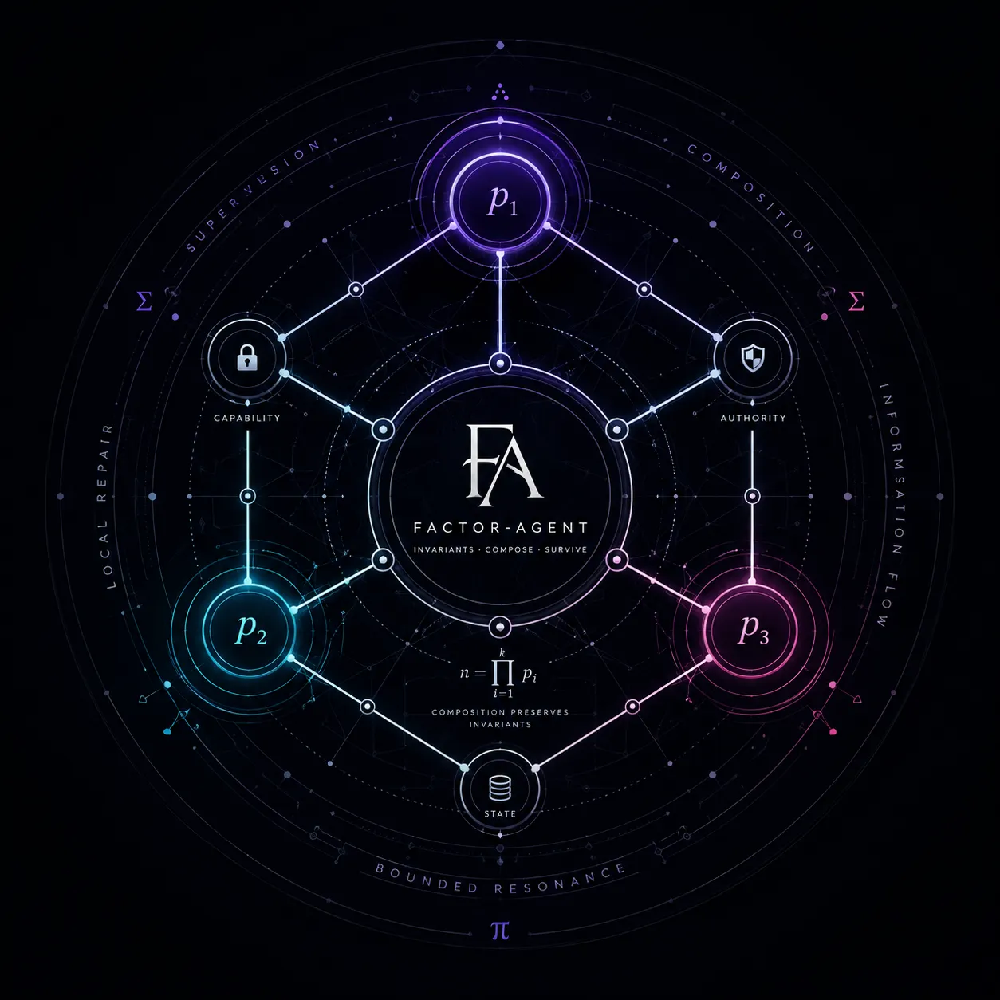

# Factor-Agent




A prime-factorized, invariant-preserving multi-agent runtime inspired by Erlang/OTP, distributed systems theory, and information-flow algebra.
Built for agents that survive production scale — not just demos.

This project accompanies the essay:

> “Agents, Erlang, and the Arithmetic of Invariants” 

---

## Why Factor-Agent Exists

Most modern agent frameworks solve orchestration problems with increasingly complicated workflow DAGs:

* planner → executor → reviewer loops
* dynamic topology mutation
* retry graphs
* memory patching
* prompt-level permission logic

These systems often fail for the same reason early navigational databases failed:

> topology complexity compensates for weak state semantics.

Factor-Agent takes the opposite approach.

Instead of making the graph smarter, it makes the substrate lawful.

The runtime is built around:

* transactional harness state
* capability-based execution
* local repair instead of global restart
* supervision trees
* compositional invariants
* bounded resonance
* explicit information flow

The core thesis is simple:

> Production agents should behave like distributed systems, not animated prompts.

---

# Core Ideas

## 1. Agents Are Processes

Every agent is an isolated worker process.

It has:

* local state
* explicit capabilities
* supervised lifecycle
* message boundaries
* repair semantics

Inspired heavily by:

* Erlang
* Open Telecom Platform
* actor systems
* distributed fault tolerance

---

## 2. State Is Algebraic

Harness state is not a chat transcript.

It is modeled as a factored object:

[
X := (i, s, c, q, \tau, a)
]

Where:

| Symbol | Meaning              |
| ------ | -------------------- |
| (i)    | identity             |
| (s)    | state                |
| (c)    | capabilities         |
| (q)    | quality / confidence |
| (\tau) | temporal validity    |
| (a)    | authority            |

Composition must preserve invariants.

---

## 3. Permissions Are Mathematical

Capabilities compose through divisibility and lattice joins.

Examples:

* clearance checks
* capability escalation
* tool gating
* write authorization
* delegation boundaries

Instead of:

```python
if role == "admin":
```

Factor-Agent treats permissions as compositional structure.

---

## 4. Failure Is Expected

Traditional agent systems frequently restart entire workflows.

Factor-Agent uses:

* local repair
* bounded retries
* supervision trees
* failure isolation

Inspired by modular arithmetic:

[
z' = z + kM
]

Repair modifies only the invalid region while preserving the larger invariant structure.

---

## 5. Cycles Are Observable

Retry storms and delegation loops are treated as graph phenomena.

The runtime tracks:

* workflow cycles
* recursion depth
* resonance amplification
* spectral instability

Inspired by:

* Ihara zeta functions
* graph spectra
* distributed system feedback analysis

---

# Architecture

```text
                ┌────────────────────┐
                │   Supervisor Tree  │
                └─────────┬──────────┘
                          │
        ┌─────────────────┼─────────────────┐
        │                 │                 │
 ┌──────▼──────┐  ┌──────▼──────┐  ┌──────▼──────┐
 │ Planner     │  │ Executor    │  │ Reviewer    │
 │ Process      │  │ Process     │  │ Process     │
 └──────┬──────┘  └──────┬──────┘  └──────┬──────┘
        │                 │                 │
        └───────── Message Bus ─────────────┘
                          │
                 ┌────────▼────────┐
                 │ Harness State   │
                 │ Invariant Layer │
                 └─────────────────┘
```

---

# Design Principles

## Invariants Over Heuristics

A valid runtime should reject impossible state transitions automatically.

The model is not trusted to “remember the rules.”

The substrate enforces them.

---

## Topology Is Derived

Workflow graphs emerge from lawful composition.

They are not hand-crafted orchestration spaghetti.

---

## Locality Over Global Coordination

Small isolated repairs outperform global retries.

---

## Explicit Capability Flow

Every side effect must be explainable.

Every permission must be checkable.

---

## Bounded Resonance

Uncontrolled recursive delegation destroys systems.

Feedback loops must be measurable and constrained.

---

# Example Concepts

## Capability Join

```text
planner_capability  ∨ reviewer_capability
```

Produces a lawful combined authority set.

---

## Local Repair

Instead of:

```text
restart_entire_workflow()
```

Factor-Agent attempts:

```text
repair_invalid_subgraph()
```

---

## Supervised Execution

```elixir
Supervisor
├── PlannerAgent
├── ToolExecutor
├── MemoryAgent
└── ReviewerAgent
```

Failures are isolated and restartable.

---

# What This Is NOT

Factor-Agent is NOT:

* a prompt chaining library
* an “AI wrapper”
* a chatbot framework
* a no-code orchestration DAG editor
* an autonomous AGI project

It is a systems-runtime philosophy for reliable agentic computation.

---

# Inspirations

This project draws from:

* Joe Armstrong
* Edgar F. Codd
* distributed systems engineering
* actor-model computation
* graph spectral theory
* information-flow lattices
* capability security
* transactional systems
* fault-tolerant telecom infrastructure

---

# Relationship to Modern Agent Frameworks

Factor-Agent is compatible with LLM-based systems, but it critiques the dominant architecture trend:

| Common Agent Systems | Factor-Agent           |
| -------------------- | ---------------------- |
| topology-first       | invariant-first        |
| retry orchestration  | local repair           |
| prompt permissions   | capability enforcement |
| mutable DAGs         | lawful composition     |
| opaque memory        | governed state         |
| global workflows     | supervised processes   |

---

# Current Status

Experimental research runtime.

The repository currently focuses on:

* invariant modeling
* capability algebra
* supervision semantics
* runtime architecture
* distributed repair theory

Future work may include:

* formal state transition proofs
* typed capability systems
* distributed execution runtime
* graph resonance monitoring
* OTP-native implementations
* retrieval invariants
* transactional memory substrates

---

# Philosophy

Factor-Agent treats agent systems as a branch of distributed systems engineering.

The important question is not:

> “Can the model reason?”

But:

> “Can the runtime preserve truth under scale, failure, concurrency, and recursion?”

That is the real production problem.

---

# Related Essay

“Agents, Erlang, and the Arithmetic of Invariants” 

Core themes:

* prime factorization as architectural decomposition
* OTP supervision as computational factorization
* graph cycles and resonance
* information-flow lattices
* transactional shared state
* capability-based execution
* invariant-preserving composition

---

# License

Apache-2.0 for stronger contribution governance.

---

# Closing

> Your DAG is a symptom.
> Stop mutating the graph.
> Start governing the state.
